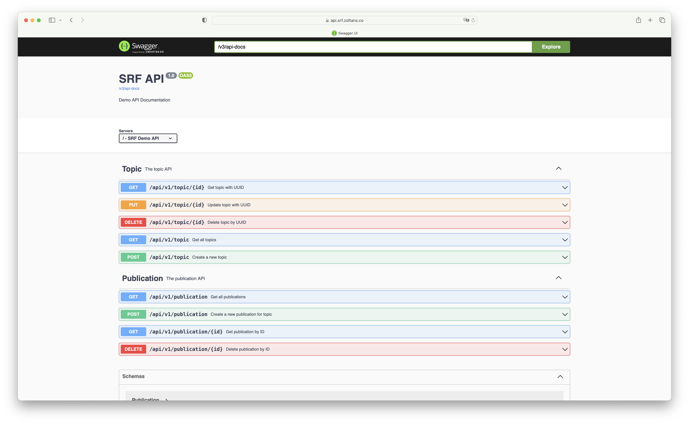
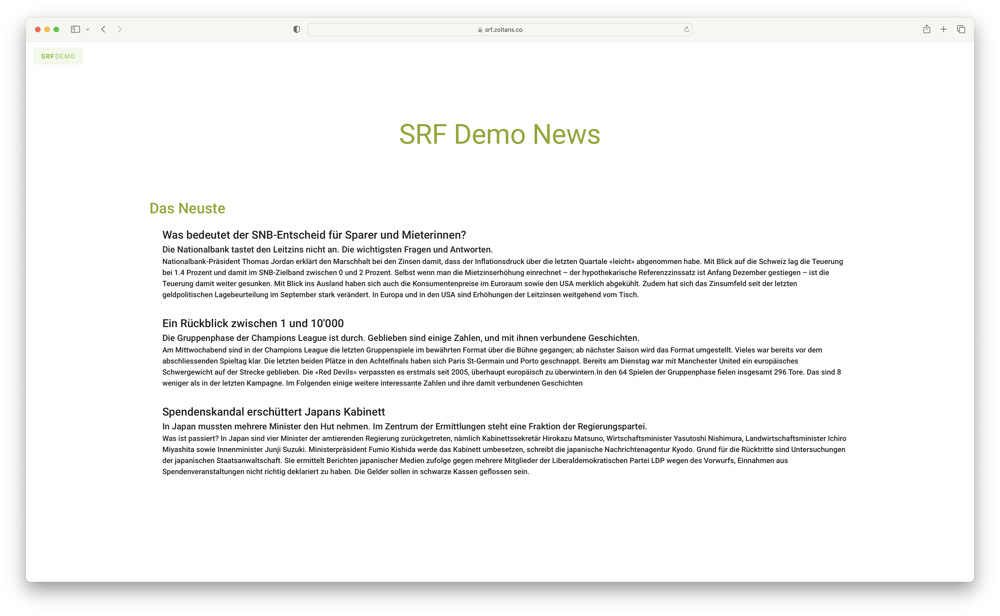
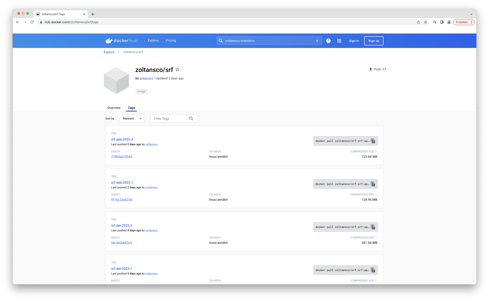

# This is a demo project for SRF

Features:
- Self hosted on linux server using docker containers
- Valid Lets Encrypt certificate
- Uses only the following technologies like: Java, SpringBoot, Swagger, MySQL, Docker

## Links:
[API -> api.srf.zoltans.co](https://api.srf.zoltans.co)

[UI -> srf.zoltans.co/](https://srf.zoltans.co/)

[Docker Hub images -> hub.docker.com/r/zoltansco/srf/tags ](https://hub.docker.com/r/zoltansco/srf/tags)

